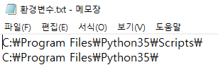
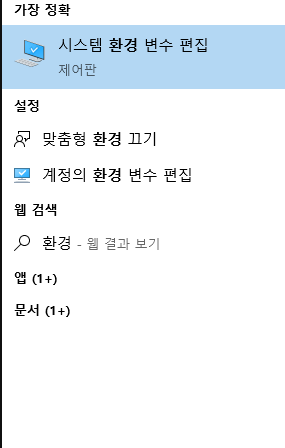
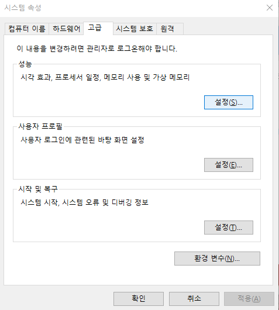
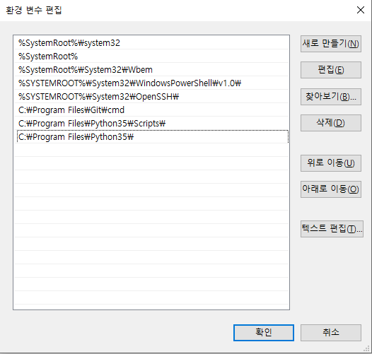
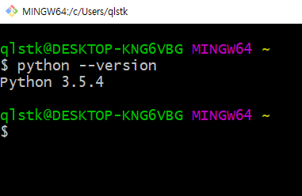

# 파이썬 버전 3.5 만들기

1. 먼저 바탕화면에 저장해 두었던 `환경변수.txt` 를 열어봅니다.

   

2. 윈도우키를 눌러 환경 이라고 검색해서 나오는 `시스템 환경 변수 편집`을 선택합니다.

   

3. 고급 탭 아래의 `환경 변수` 버튼을 누릅니다.

   

4. 아래 시스템 변수 목록에서 `Path` 를 찾아 `편집` 버튼을 누릅니다.

   

5. `새로 만들기` 버튼을 눌러 `1번`에서 열었던 항목을 아래 그림과 같이 적어 넣습니다.

   

6. `확인` 버튼을 눌러 종료하고(나머지 창들도 모두 `확인`), 터미널창을 새로 열어서(이미 열려있었다면 반드시 종료 후 재시작) 3.5 버전이 되었는지 확인해 봅니다.

   